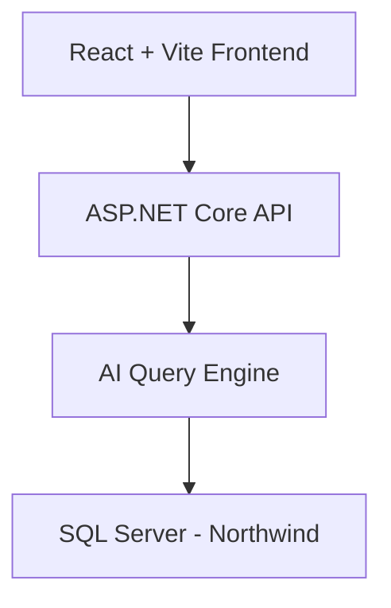
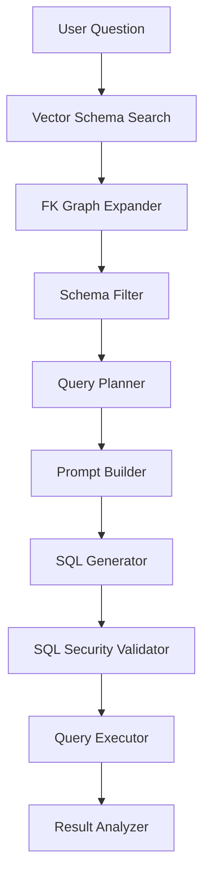

# 🧠 Northwind AI Web Assistant

## 🚀 Overview

Northwind AI Web is an AI-powered Business Intelligence web application that enables users to query a relational database using natural language. The system transforms user questions into secure, optimized SQL queries through a structured AI pipeline, returning results ready for analysis and visualization.

This project demonstrates the integration of modern web technologies with advanced AI query orchestration, bridging the gap between non-technical users and complex data systems.

---

## 🏗️ System Architecture

### High-Level Architecture



---

### 🔬 AI Query Pipeline



---

## ⚙️ How It Works

The system processes natural language queries through a multi-stage AI pipeline:

* **Vector Schema Search**: Identifies relevant tables using semantic similarity
* **FK Graph Expander**: Expands relationships via foreign key graph traversal
* **Schema Filter**: Reduces schema complexity to only necessary entities
* **Query Planner**: Defines the logical structure of the query before generation
* **Prompt Builder**: Constructs optimized prompts for the language model
* **SQL Generator**: Produces SQL queries from structured prompts
* **SQL Security Validator**: Prevents unsafe or malicious queries
* **Query Executor**: Executes validated SQL against the database
* **Result Analyzer**: Transforms raw results into structured, visualization-ready data

---

## ✨ Key Features

* 🔎 Natural Language to SQL conversion
* 🧠 AI-driven query planning and optimization
* 🔐 Secure SQL validation layer
* ⚡ Modular and extensible pipeline architecture
* 📊 Visualization-ready output (charts, dashboards)
* 🧩 Decoupled frontend and backend architecture

---

## 🧪 Example Use Case

**User Input:**

> "Show total sales by product"

**System Output:**

* Automatically generated SQL query
* Aggregated dataset
* Structured response ready for chart rendering

---

## 🛠️ Technology Stack

### Frontend

* React
* Vite
* Recharts (for data visualization)

### Backend

* ASP.NET Core Web API
* C#
* MemoryCache

### Data Layer

* SQL Server
* Northwind Sample Database

### AI & Processing

* Large Language Models (LLMs)
* Prompt Engineering
* Vector-based schema retrieval

---

## ▶️ Getting Started

### Prerequisites

* Node.js
* .NET 6+
* SQL Server

### Run Backend

```bash
dotnet run
```

### Run Frontend

```bash
npm install
npm run dev
```

---

## 📁 Project Structure

```
/frontend        → React + Vite client
/backend         → ASP.NET Core API
/docs            → Architecture diagrams and documentation
```

---

## 📊 Future Improvements

* Dashboard builder with dynamic chart selection
* Multi-database support
* Role-based query security
* Query history and analytics
* Integration with BI tools

---

## 🤝 Contribution

Contributions are welcome. Please fork the repository and submit a pull request.

---

## 📄 License

This project is licensed under the MIT License.

---

## 👨‍💻 Author

Developed as part of an advanced AI + Data Engineering portfolio project.
