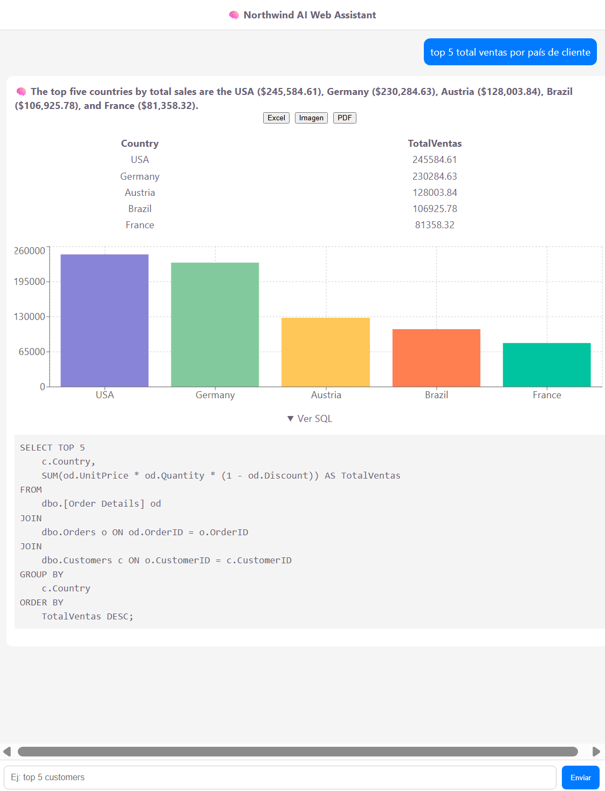
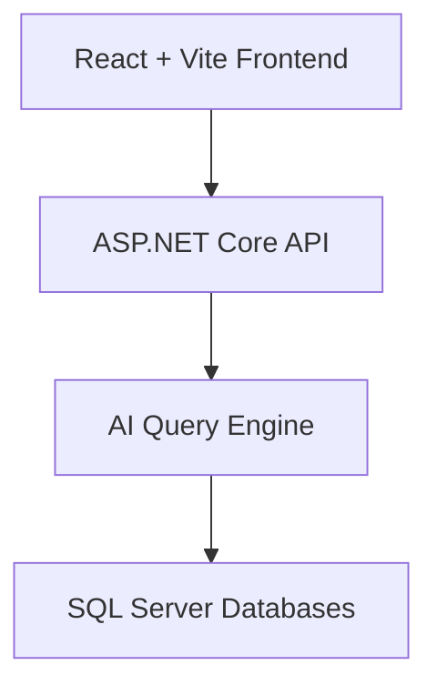
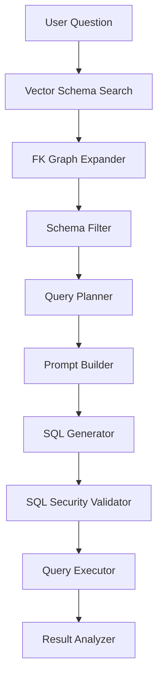

# 🧠 Northwind AI Web Assistant

## 🚀 Overview

Northwind AI Web Assistant is an AI-powered Business Intelligence web application that allows users to query relational databases using natural language.

Instead of writing SQL, users interact through a **chat-based interface**, and the system transforms questions into secure, optimized queries, returning results ready for analysis, visualization, and export.

> ⚡ **Proven Multi-Database Capability**
> Successfully tested with **Northwind**, **AdventureWorks**, and **AdventureWorksDW**, handling everything from simple schemas to enterprise-grade data models.

---

## 📸 Demo



> 💡 Conversational BI experience with charts, SQL transparency, and export features.

---

## 💬 Intelligent Chat Interface

### 🧠 Chat-Based Experience

* Conversational interface inspired by ChatGPT
* Users ask questions in plain language
* No SQL knowledge required
* Responses include:

  * AI-generated analysis
  * Data tables
  * Charts
  * SQL query (expandable)

---

### 📱 Mobile-Friendly Design

* Fully responsive (desktop + mobile)
* Optimized for smartphone browsers
* Sticky input bar (chat-style)
* Smooth scrolling experience

> 📲 Enables data analysis **from anywhere**, directly on mobile.

---

### 📊 Integrated Data Visualization

Each query automatically returns:

* 📋 Structured table
* 📈 Bar chart visualization
* Clean and readable layout

The system prepares data for visualization automatically — no manual configuration needed.

---

### 📤 Export & Reporting Features

Users can export results instantly:

#### 📄 PDF Report

* Includes AI-generated analysis
* Data table
* Embedded chart

#### 📊 Excel Export (.xlsx)

* Raw structured data
* Includes metadata (row count, timestamp)

#### 🖼️ Chart Export (.png)

* High-quality chart image

> ⚡ Turns the app into a lightweight BI reporting tool.

---

### 🧠 AI-Generated Insights

Beyond raw data, the system provides:

* Natural language analysis
* Business-friendly summaries
* Context-aware insights

> Users don’t just see data — they **understand it immediately**.

---

## 🏗️ System Architecture

### High-Level Architecture



---

### 🔬 AI Query Pipeline



---

## ⚙️ How It Works

The system processes queries through a multi-stage AI pipeline:

* **Vector Schema Search** → Finds relevant tables
* **FK Graph Expander** → Resolves relationships
* **Schema Filter** → Reduces complexity
* **Query Planner** → Structures query logic
* **Prompt Builder** → Prepares LLM input
* **SQL Generator** → Generates SQL
* **SQL Security Validator** → Ensures safety
* **Query Executor** → Runs query
* **Result Analyzer** → Produces insights + visualization-ready data

---

## ✨ Key Features

* 🔎 Natural Language to SQL conversion
* 🧠 AI-driven query planning
* 🔐 Secure SQL validation
* 📊 Automatic chart generation
* 📄 SQL transparency (expandable view)
* 📤 Multi-format export (PDF, Excel, PNG)
* 📱 Mobile-ready UI
* 🧩 Modular architecture
* 🗄️ Multi-database support

---

## 🧪 Supported Databases

### Northwind

* Simple transactional schema
* Ideal for demos and baseline testing

### AdventureWorks

* Complex OLTP system
* Multi-schema relationships

### AdventureWorksDW

* Data warehouse model
* Star schema (fact + dimensions)

> ✅ Demonstrates adaptability from simple datasets to enterprise BI scenarios.

---

## 🧪 Example Use Case

**User Input:**

> "top 5 total sales by country"

**System Output:**

* SQL query generated automatically
* Aggregated dataset
* AI-generated analysis
* Bar chart visualization
* Export options (PDF / Excel / PNG)

---

## 🛠️ Technology Stack

### Frontend

* React
* Vite
* Recharts

### Backend

* ASP.NET Core Web API
* C#
* MemoryCache

### Data Layer

* SQL Server
* Northwind
* AdventureWorks
* AdventureWorksDW

### AI & Processing

* Large Language Models (LLMs)
* Prompt Engineering
* Vector-based schema retrieval

---

## ▶️ Getting Started

### Prerequisites

* Node.js
* .NET 6+
* SQL Server

---

### Run Backend

```bash
dotnet run
```

---

### Run Frontend

```bash
npm install
npm run dev
```

---

## 📁 Project Structure

```
/frontend        → React + Vite client
/backend         → ASP.NET Core API
/docs            → Documentation & assets
```

---

## 🧠 Architecture Decisions & Trade-offs

### 1️⃣ Decoupled Frontend & Backend

**Why:**

* Independent scaling
* Clean separation

**Trade-off:**

* Requires CORS configuration

---

### 2️⃣ Multi-Stage AI Pipeline

**Why:**

* Better accuracy
* Debuggable

**Trade-off:**

* More complex system

---

### 3️⃣ Schema-Aware Querying

**Why:**

* Prevents hallucinations
* Ensures valid joins

**Trade-off:**

* Requires schema indexing

---

### 4️⃣ SQL Security Layer

**Why:**

* Prevents destructive queries

**Trade-off:**

* May restrict edge cases

---

### 5️⃣ OLTP + OLAP Support

**Why:**

* Works with transactional and analytical DBs

**Trade-off:**

* More complex logic

---

### 6️⃣ Visualization-Ready Output

**Why:**

* Immediate UI integration

**Trade-off:**

* Extra backend processing

---

## 📊 Future Improvements

* AI-driven chart selection
* Dashboard builder
* Query history
* Role-based security
* BI tool integrations
* Auto-aggregation for large datasets

---

## 🤝 Contribution

Contributions are welcome. Fork the repo and submit a PR.

---

## 📄 License

MIT License

---

## 👨‍💻 Author

AI + Data Engineering portfolio project showcasing:

* Natural Language → SQL systems
* Full-stack architecture
* Business Intelligence applications
* Real-world AI orchestration pipelines

---

## ⭐ Final Note

This project demonstrates how AI can transform traditional data access into a **conversational, intuitive, and powerful BI experience**.

> From raw data → to insights → to reports — all in a single chat interface.


