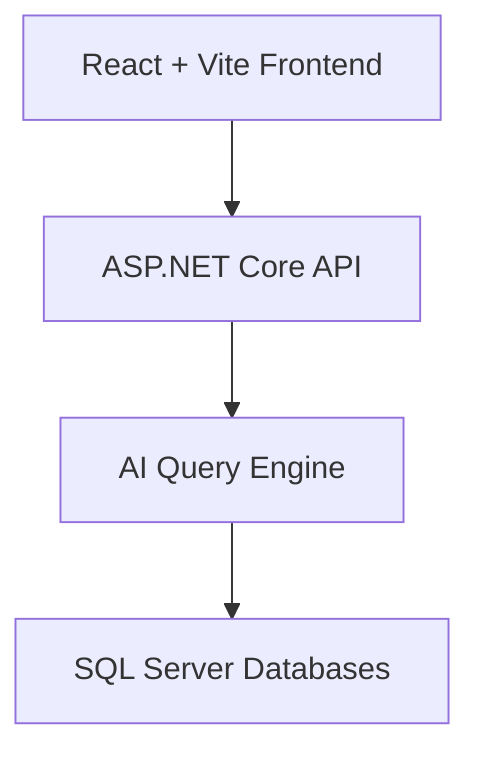
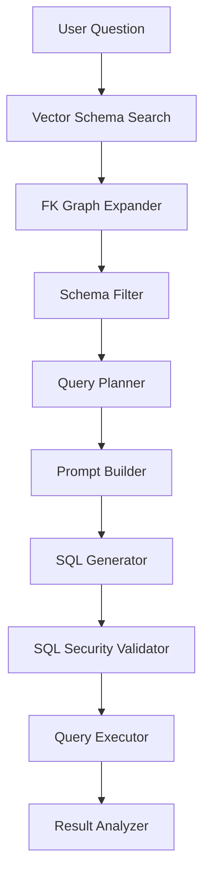

# 🧠 Northwind AI Web Assistant

## 🚀 Overview

Northwind AI Web is an AI-powered Business Intelligence web application that enables users to query relational databases using natural language. The system transforms user questions into secure, optimized SQL queries through a structured AI pipeline, returning results ready for analysis and visualization.

This project demonstrates the integration of modern web technologies with advanced AI query orchestration, bridging the gap between non-technical users and complex data systems.

> ⚡ **Proven Multi-Database Capability:**
> The system has been successfully tested not only with the Northwind sample database, but also with **AdventureWorks** and **AdventureWorksDW**, demonstrating its ability to handle complex schemas, multi-schema environments, and enterprise-grade data models.

---

## 🏗️ System Architecture

### High-Level Architecture



---

### 🔬 AI Query Pipeline



---

## ⚙️ How It Works

The system processes natural language queries through a multi-stage AI pipeline:

* **Vector Schema Search**: Identifies relevant tables using semantic similarity
* **FK Graph Expander**: Expands relationships via foreign key graph traversal
* **Schema Filter**: Reduces schema complexity to only necessary entities
* **Query Planner**: Defines the logical structure of the query before generation
* **Prompt Builder**: Constructs optimized prompts for the language model
* **SQL Generator**: Produces SQL queries from structured prompts
* **SQL Security Validator**: Prevents unsafe or malicious queries
* **Query Executor**: Executes validated SQL against the database
* **Result Analyzer**: Transforms raw results into structured, visualization-ready data

---

## ✨ Key Features

* 🔎 Natural Language to SQL conversion
* 🧠 AI-driven query planning and optimization
* 🔐 Secure SQL validation layer
* ⚡ Modular and extensible pipeline architecture
* 📊 Visualization-ready output (charts, dashboards)
* 🧩 Decoupled frontend and backend architecture
* 🗄️ Multi-database support (Northwind, AdventureWorks, AdventureWorksDW)
* 🧭 Schema-aware engine supporting multi-schema databases

---

## 🧪 Supported Databases

The system has been validated with the following SQL Server sample databases:

* **Northwind**

  * Simple transactional schema
  * Ideal for baseline validation

* **AdventureWorks**

  * Complex OLTP schema
  * Multiple schemas (Sales, Person, Production, etc.)
  * Enterprise-grade relationships

* **AdventureWorksDW**

  * Data warehouse (OLAP) model
  * Star schema (fact + dimensions)
  * Optimized for analytics and BI queries

> ✅ Demonstrates adaptability from simple datasets to enterprise-level data architectures.

---

## 🧪 Example Use Case

**User Input:**

> "Show total sales by product"

**System Output:**

* Automatically generated SQL query
* Aggregated dataset
* Structured response ready for chart rendering
* Optional visualization (charts)

---

## 🛠️ Technology Stack

### Frontend

* React
* Vite
* Recharts

### Backend

* ASP.NET Core Web API
* C#
* MemoryCache

### Data Layer

* SQL Server
* Northwind
* AdventureWorks
* AdventureWorksDW

### AI & Processing

* Large Language Models (LLMs)
* Prompt Engineering
* Vector-based schema retrieval

---

## ▶️ Getting Started

### Prerequisites

* Node.js
* .NET 6+
* SQL Server

---

### Run Backend

```bash
dotnet run
```

---

### Run Frontend

```bash
npm install
npm run dev
```

---

## 📁 Project Structure

```
/frontend        → React + Vite client
/backend         → ASP.NET Core API
/docs            → Architecture diagrams and documentation
```

---

## 🧠 Architecture Decisions & Trade-offs

This project was designed with a focus on **scalability, modularity, and real-world applicability**. Below are the key architectural decisions and their trade-offs:

---

### 1️⃣ Decoupled Frontend and Backend

**Decision:**
Separate React frontend from ASP.NET Core API.

**Why:**

* Independent scaling and deployment
* Better developer experience
* Aligns with modern microservice/front-end architecture

**Trade-off:**

* Requires handling CORS / proxy in development
* Slightly more complex setup

---

### 2️⃣ Multi-Stage AI Query Pipeline

**Decision:**
Break query generation into multiple steps instead of a single LLM prompt.

**Why:**

* Improves accuracy and control
* Enables debugging and observability
* Allows fine-tuned optimizations per stage

**Trade-off:**

* Increased system complexity
* More components to maintain

---

### 3️⃣ Schema-Aware Query Generation

**Decision:**
Use schema metadata + vector search instead of raw prompting.

**Why:**

* Reduces hallucinations
* Ensures valid joins and relationships
* Works with large, multi-schema databases

**Trade-off:**

* Requires schema extraction and indexing
* Additional preprocessing step

---

### 4️⃣ SQL Security Validation Layer

**Decision:**
Validate generated SQL before execution.

**Why:**

* Prevents dangerous queries (DROP, DELETE, etc.)
* Adds production-level safety

**Trade-off:**

* May block some advanced queries
* Requires rule tuning

---

### 5️⃣ Support for OLTP and OLAP Databases

**Decision:**
Design engine to work with both transactional and analytical schemas.

**Why:**

* Works with **Northwind (OLTP)**
* Works with **AdventureWorks (OLTP)**
* Works with **AdventureWorksDW (OLAP)**

**Trade-off:**

* More complex query planning logic
* Requires flexible schema interpretation

---

### 6️⃣ Visualization-Ready Output

**Decision:**
Return structured JSON suitable for charts.

**Why:**

* Enables immediate integration with UI (Recharts)
* Simplifies frontend logic

**Trade-off:**

* Additional transformation layer in backend

---

## 📊 Future Improvements

* Dashboard builder with dynamic chart selection
* Multi-database auto-detection
* Role-based query security
* Query history and analytics
* Integration with BI tools
* AI-driven chart recommendations

---

## 🤝 Contribution

Contributions are welcome. Please fork the repository and submit a pull request.

---

## 📄 License

This project is licensed under the MIT License.

---

## 👨‍💻 Author

Developed as part of an advanced AI + Data Engineering portfolio project, showcasing:

* AI-driven SQL generation
* Full-stack architecture (React + ASP.NET Core)
* Support for both transactional and analytical databases
* Real-world Business Intelligence applications

